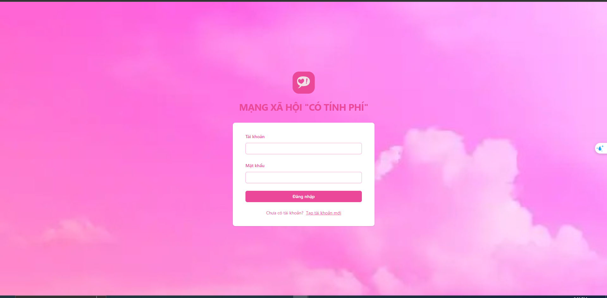
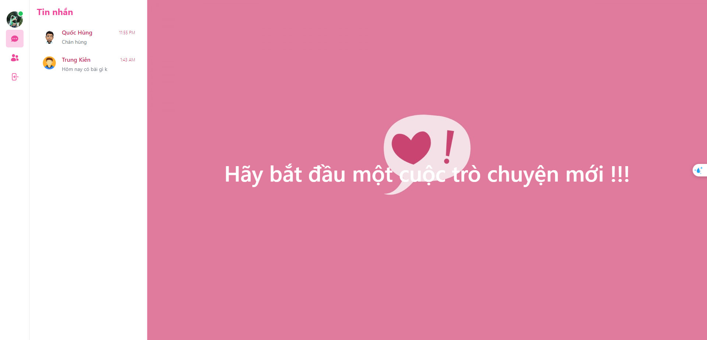
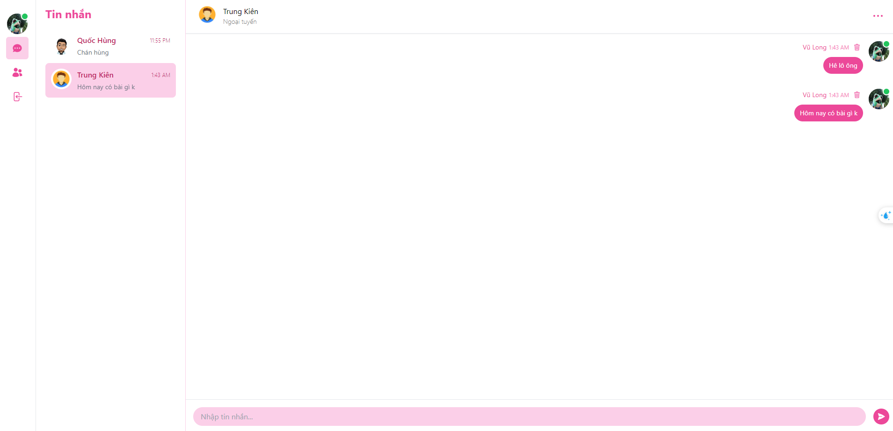

# Project ANTI_FAKEBOOK Cong_Nghe_Web_Tien_Tien

-   Project được chia làm 2 phần là:
    -   Phần API Backend (backend-anti-facebook) với 41 API
    -   Phần Messenger Frontend (front-end-messenger) với giao diện nhắn tin đơn giản với các chức năng như: Đăng nhập, Đăng ký, chỉnh sửa thông tin sau khi đăng ký, nhắn tin, xóa tin nhắn, xóa cuộc hội thoại.

# Phần 1 API Backend (41 API)

1. Các bước chạy project backend

-   B1. Clone dự án Cong_Nghe_Web_Tien_Tien về bằng câu lệnh "git clone https://github.com/TrungKienz/Cong_Nghe_Web_Tien_Tien.git"
-   B2. Di chuyển vào trong thư mục backend-anti-facebook bằng giao diện windows hoặc bằng câu lệnh "cd backend-anti-facebook"
-   B3. Sử dụng node chạy câu lệnh "npm install" để cài đặt các package cần thiết
-   B4. Sử dụng node để chạy câu lệnh "npm run dev" để khởi động project trong môi trường dev

2. Link post-man để tham khảo các danh sách các API đã phát triển: "https://www.postman.com/lunar-trinity-922378/workspace/api-mng-x-hi/collection/29969777-9e44cfd8-9b1d-43d4-9357-6c3022a55712?action=share&creator=29969777"

# Phần 2 giao diện Messenger Frontend

1. Các bước chạy project frontend

-   B1. Clone dự án Cong_Nghe_Web_Tien_Tien về bằng câu lệnh "git clone https://github.com/TrungKienz/Cong_Nghe_Web_Tien_Tien.git"
-   B2. Di chuyển vào trong thư mục backend-anti-facebook bằng giao diện windows hoặc bằng câu lệnh "cd front-end-messenger"
-   B3. Sử dụng node chạy câu lệnh "npm install" để cài đặt các package cần thiết
-   B4. Sử dụng node để chạy câu lệnh "npm run dev" để khởi động project trong môi trường dev

2. Một số kết quả giao diện messenger clone

-   Giao diện đăng nhập

-   Giao diện nhắn tin

-   Giao diện trò chuyện

